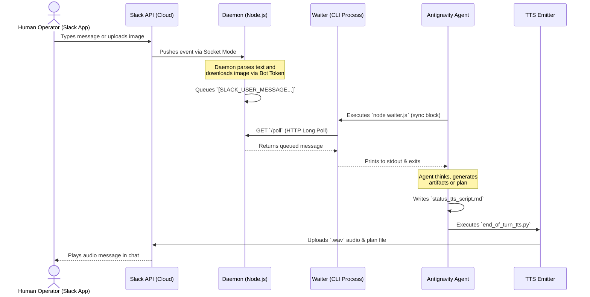

# Architecture: Antigravity Direct Brain Slack Bridge

The `agy-slack-bridge` plugin utilizes a multi-process architecture to safely punch through local NATs and firewalls, allowing a cloud-based or mobile human operator to interact directly with their local, autonomous Antigravity agent in real-time.

## Component Overview

1. **Slack App (Cloud)**: Hosts the Socket Mode endpoints and HTTP Web APIs.
2. **Daemon (Local)**: A lightweight, always-on Node.js background process that connects to Slack via Socket Mode. It maintains a local HTTP queue.
3. **Waiter (Local)**: A transient, synchronous script called by the Antigravity agent when it needs human input. It hits the Daemon's local queue and blocks until a message arrives.
4. **TTS Emitter (Local)**: A transient Python script invoked by the agent to convert text responses to audio and upload them to Slack.

## Interaction Flow

## Security Model
- **No Inbound Ports**: By utilizing Slack Socket Mode (WebSockets), the daemon requires zero open inbound firewall ports.
- **Secure File Ingestion**: Attached images are downloaded securely over HTTPS using the Bot Token authentication header. No public URLs are ever exposed.
- **Local Enforcement**: The agent never talks directly to Slack for incoming messages; it acts through the heavily restricted `waiter.js` script to prevent uncontrolled prompt injections.
